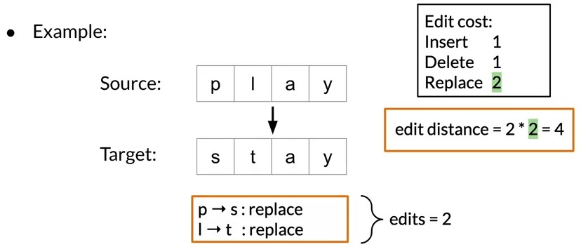
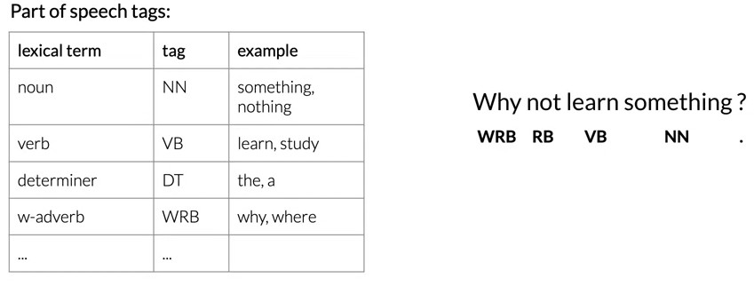
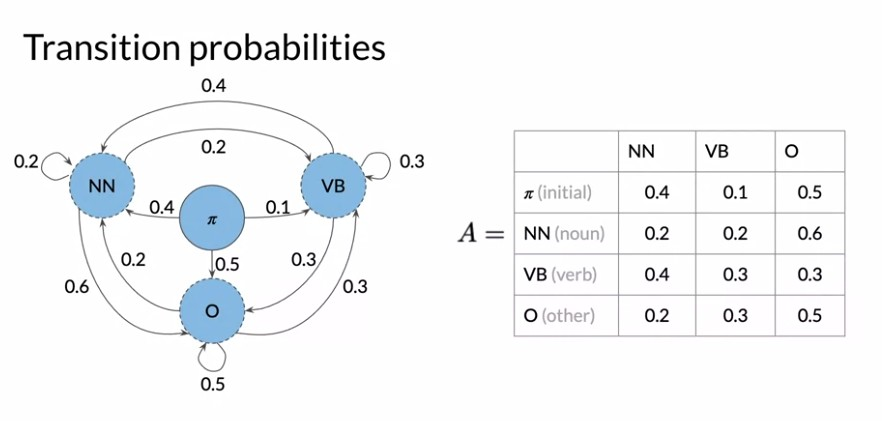
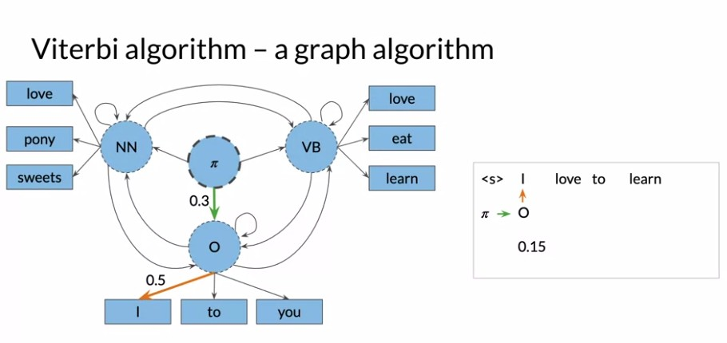
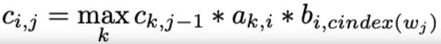
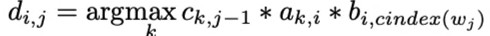
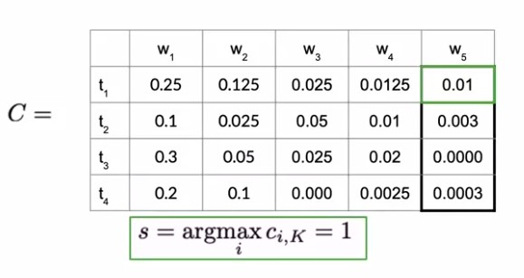

Course 2: Natural Language Processing with Probabilistic Model
This is the second course of the Natural Language Processing specialization at [Coursera](https://www.coursera.org/programs/educational-flag-learning-program-0tkxi?currentTab=MY_COURSES&productId=_U5cASTxEemuhAoKFebZeA&productType=s12n&showMiniModal=true) which is moderated by [DeepLearning.ai](http://deeplearning.ai/).

## Table of contents
* [Course 2: Natural Language Processing with Probabilistic Model](#course-2-natural-language-processing-with-probabilistic-model)
   
   * [Week 1: Auto-correct and Dynamic Programming](#week-1-auto-correct-and-dynamic-programming)
      * [auto-correct](#auto-correct)
      * [Minimum edit distance](#minimum-edit-distance)
      * [Applications](#applications)
   
   * [Week 2: Part of Speech Tagging and Hidden Markov Models](#week-2-part-of-speech-tagging-and-hidden-markov-models)
      * [Part of Speech Tagging](#part-of-speech-tagging)
          * [Applications](#applications)
      * [Markov Chains](#markov-chains)
      * [The Viterbi Algorithm)](#the-viterbi-algorithm)
   
   * [Week 3: Autocomplete and Language Models](#week-3-autocomplete-and-language-models)
      * [N-Grams](#n-grams)
      * [N-grams and Probabilities](#n-grams-and-probabilities)
      * [Sequence Probabilities](#sequence-probabilities)
      * [Starting and Ending Sentences](#starting-and-ending-sentences)
      * [The N-gram Language Model](#the-n-gram-language-model)
      * [Language Model evaluation](#language-model-evaluation)
      * [Out of Vocabulary Words](#out-of-vocabulary-words)
      * [Smoothing](#smoothing)

   * [Week 4: Word Embeddings](#week-4-word-embeddings)
      * [Basic Word Representations](#basic-word-representations )
      * [Basic word embedding methods](#basic-word-embedding-methods)
      * [Advanced word embedding methods](#advanced-word-embedding-methods)
      * [Continuous Bag-of-Words Model](#continuous-bag-of-words-model)
          * [Architecture](#architecture)
          * [Cost Function](#cost-function)
      * [Extracting Word Embedding Vectors](#extracting-word-embedding-vectors)

## Week 2: Auto-correct and Dynamic Programming

### Auto-correct
- is an application that changes misspelled words into the correct ones.
    - Example: Happy birthday deah friend! ==> dear.
- How it works:
    - 1.Identify a misspelled word
	  - 2. Find strings n edit distance away
	  - 3. Filter candidates
	  - 4. Calculate word probabilities

### Minimum edit distance
- Evaluate the similarity between 2 strings.
- Minimum number of edits needed to transform 1 string into another.
- The algorithm try to minimize the edit cost.
- 

### Applications
- Spelling correction
- document similarity
- machine translation
- DNA sequencing

## Part of Speech Tagging and Hidden Markov Models

### Part of Speech Tagging
- The category of words or the lexical terms in the language.
- Tags: Noun, Verb, adjective, preposition, adverb,...
- 

#### Applications
- Named entities
- Co-reference resolution
- Speech recognition

### Markov Chains
- A stochastic model describing a sequence of possible events.
- 

### The Viterbi Algorithm
- A graph algorithm that finds the sequence of hidden states or parts of speech tags that have the highest probability for a sequence.
- 
- Given your transition and emission probabilities, we first populates and then use the auxiliary matrices C and D.
- **Matrix C** holds the intermediate optimal <ins>probabilities</ins>.
	- 
- **Matrix D** holds the <ins>indices</ins> of the visited states (tags).
	- 
- 

## Word Embeddings

### Basic Word Representations
1. Integers
    - Simple                          + 
    - Ordering: no semantic sense     -
2. One-hot vectors
    - Simple                          +
    - No implied ordering             +
    - Takes a lot of time and space   -
    - No embedded meaning             -
3. Word embedding vectors
    - Low dimension                   +
        - e.g. semantic distance: forest ≈ tree.
    - Embed meaning                   +
        - e.g. analogies: Paris:France :: Rome:?
        
        
### Basic word embedding methods
- **word2vec** (Google, 2013)
    - **Continuous bag-of-words (CBOW):** Which predict the missing word just giving the surround word.
    - **Continuous skip-gram (SGNS):** Which does the reverse of the CBOW method, SGNS learns to predict the word surrounding a given input word.
- **Global Vectors (GloVe)** (Stanford, 2014)
- **FastText** (Facebook, 2016): based on the skip-gram model.
    
### Advanced word embedding methods
- Tunable pre-trained models:
    - **BERT** (Google, 2018)
    - **ELMo** (Allen Institute for AI, 2018)
    - **GPT-2** (OpenAI, 2018)
