# Course 3: Natural Language Processing with Sequence Models
This is the last course of the Natural Language Processing specialization at [Coursera](https://www.coursera.org/programs/educational-flag-learning-program-0tkxi?currentTab=MY_COURSES&productId=_U5cASTxEemuhAoKFebZeA&productType=s12n&showMiniModal=true) which is moderated by [DeepLearning.ai](http://deeplearning.ai/).

## Table of contents
* [Course 3: Natural Language Processing with Sequence Models](#course-3-natural-language-processing-with-sequence-models)
   
   * [Week 2: Traditional Language models](#week-2-traditional-language-models)
      * [Recurrent Neural Networks](#recurrent-neural-networks)
      * [Gated Recurrent Units](#gated-recurrent-units)
      * [Bi-directional RNNs](#bi-directional-rnns)
      * [Deep RNNs](#deep-rnns)
   
   * [Week 3: LSTMs and Named Entity Recognition](#week-3-part-of-speech-tagging-and-hidden-markov-models)
      * [RNNs Advantages and Disadvantages](#rnns-advantages-and-disadvantages)
          * [Vanishing / Exploding gradients problem](#vanishing-/-exploding-gradients-problem)
          * [Solutions)](#solutions)
      * [Long-Short-Term Memory (LSTM)](#long-short-term-memory-(lstm))
          * [Summary](#summary)
          * [Applications)](#applications)
      * [Name Entity Recognition](#name-entity-recognition)
          * [Processing data)](#processing-data)
          * [Training the NER)](#training-the-ner)
    * [Week 4: Siamese Network](#week-4-siamese-network)
      * [Siamese Networks](#siamese-networks)
          * [Applications)](#applications)
          * [Model Architecture](#model-architecture)
          * [Loss Function](#loss-function)
          * [One Shot Learning](#one-shot-learning)

## Week 2: Traditional Language models

### Recurrent Neural Networks (RNNs)
- Recurrent Neural Network is a generalization of feed-forward neural network that has an internal memory.
- A Vanilla RNN
	+ 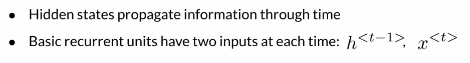
	+ 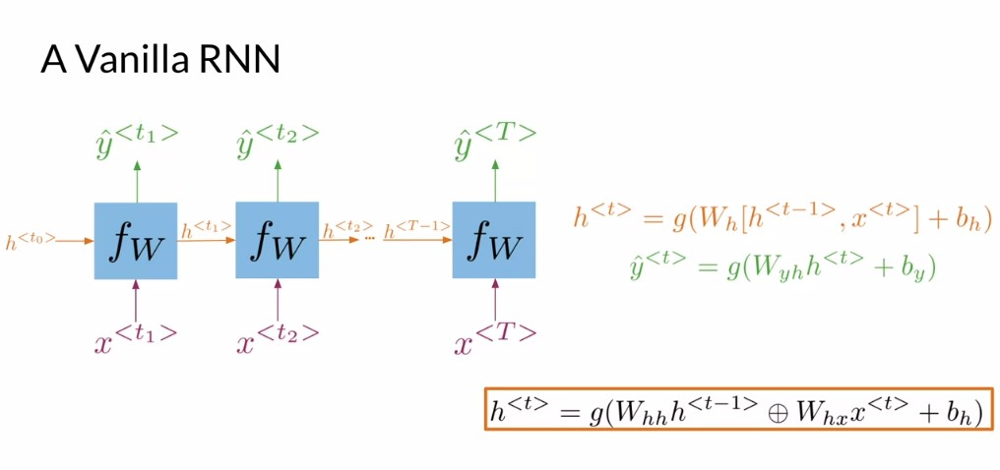
- **RNN Types**
	+ One to One
    	+ One to Many
    	+ Many to Many
    
### Gated Recurrent Units
- Relevance ‘r’ and update ‘ r ’ and update ‘ and update ‘r’ and update ‘ u ’ and update ‘ gates to remember important prior information.
- 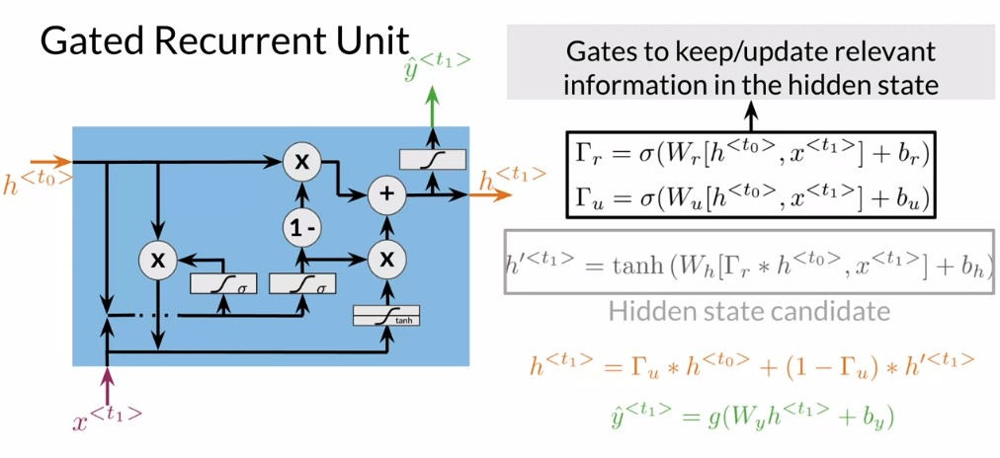
- 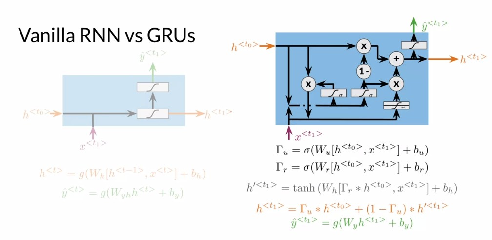

### Bi-directional RNNs
- Works in much the same way that simple RNNs do, but the information flows in both directions.
- 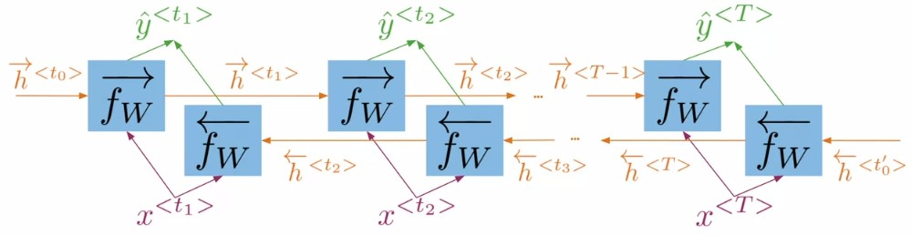

### Deep RNNs
- Just RNNs stacked together.
- 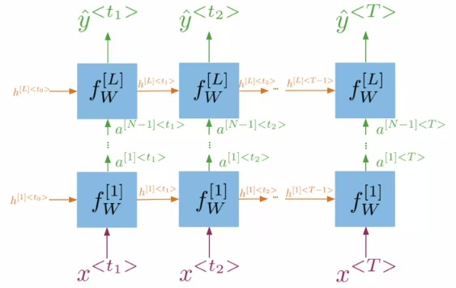

## Week 3: LSTM and Named Entity Recognition
- **RNNs Advantages and Disadvantages**
    + Captures dependencies within a short range (+)
    + Takes up less RAM than other n-gram models (+)
    + Struggles with longer sequences (-)
    + Prone to vanishing or exploding gradients (-)

#### Vanishing / Exploding gradients problem
- The Vanishing / Exploding gradients occurs when your derivatives become very small or very big.
- 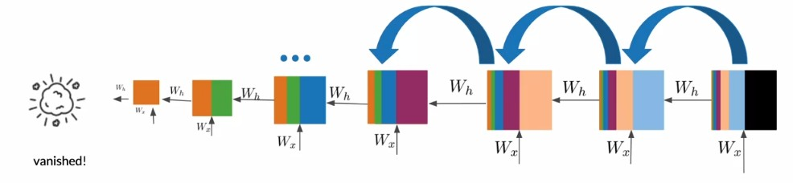

#### Solutions
- Identity matrix with ReLU activation (Identity RNN)
- Gradient clipping
- Skip-Connections

### Long-Short-Term Memory (LSTM)
- A type of RNNs which has the ability to learn and remember over long sequences of input data through the use of “gates” which regulate the information flow of the network. gates ” which regulate the information flow of the network. which regulate the information flow of the network.
- 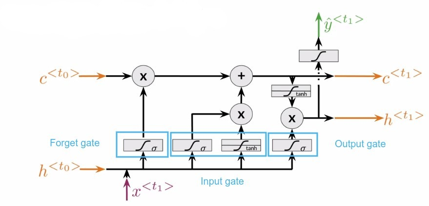
    + c: cell state (memory)
    + h: hidden state
#### Summary
- LSTM use three gates to decide which information to keep:
    + Forget gate: decides what to keep.
    + Input gate: decides what to add.
    + Output gate: decides what the next hidden state will be.

#### Applications
- Next character prediction
- Chatbots
- Music composition
- Image Captioning
- Speech recognition

### Name Entity Recognition

#### Processing data
1. Assign each entity class a number.
2. Assign each word a number.

#### Training the NER
1. Create tensor for each input and its corresponding number.
2. Put them in a batch.(power of 2 for faster processing time due to the CPU architecture)
3. Feed it into an LSTM unit.
4. Run the output through a dense layer.
5. Predict using a log softmax over K classes. (log softmax gives better numerical performance and gradient optimization)
        
## Week 4: Siamese Network
    
### Siamese Networks
- Neural network architectures that contain two or more identical subnetworks It is used to find the similarity of the inputs.
- How old are you? = What is your age?
- Where are you from? != Where are you going?

#### Applications
- Handwritten checks
- Question duplicates
- Queries

#### Model Architecture
- 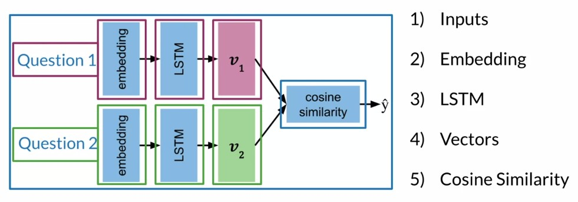
    + Note: The architecture presented here is just an example. Not all Siamese networks will be designed to contain LSTMs.
    
#### Loss Function
- Triplet loss is a loss function where a baseline **(anchor)** input is compared to a positive **(truthy)** input and a negative **(falsy)** input.
- You will be comparing the vectors using similarity s(v1, v2).
    + Similarity is bounded between -1 and 1
    + Completely different vectors, s is near -1
    + Nearly identical vectors, s is near 1
- 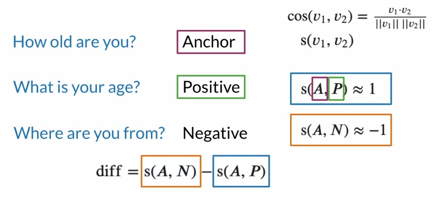
- 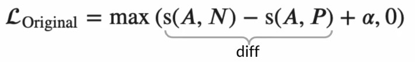
    + - alpha is a margin term used for model optimization.
    
#### One Shot Learning
- Classify new classes without retraining any models. You only need to learn the similarity function once.
