# Course 4: Natural Language Processing with Attention Models
This is the last course of the Natural Language Processing specialization at [Coursera](https://www.coursera.org/programs/educational-flag-learning-program-0tkxi?currentTab=MY_COURSES&productId=_U5cASTxEemuhAoKFebZeA&productType=s12n&showMiniModal=true) which is moderated by [DeepLearning.ai](http://deeplearning.ai/).

## Table of contents
* [Course 4: Natural Language Processing with Attention Models](#course-4-natural-language-processing-with-attention-models)
   
  * [Week 1: Neural Machine Translation (NMT)](#week-1-neural-machine-translation-NMT)
    * [Seq2seq (Google 2014)](#seq2seq-google-2014)
      * [Intuition](#intuition)
      * [Problems](#problems)
      * [Solution](#solution)
    * [Alignment](#alignment)
    * [Attention](#attention)
      * [Intuition](#intuition)
    * [Attention: Examples](#attention-examples)
      * [seq2seq with bidirectional encoder + attention](#seq2seq-with-bidirectional-encoder-+-attention)
        * [Intuition](#intuition)
      * [seq2seq with 2-layer stacked encoder + attention](#seq2seq-with-2-layer-stacked-encoder-+-attention)
        * [Intuition](#intuition)
      * [seq2seq with 8-stacked encoder (+bidirection+residual connections) + attention](#seq2seq-with-8-stacked-encoder-(+bidirection+residual-connections)-+-attention)
        * [Intuition](#intuition)
    * [Score Functions](#score-functions)
    * [Training an NMT with Attention](#training-an-nmt-with-attention)
      * [Teacher Forcing ](#teacher-forcing)
      * [Training NMT](#training-nmt)
    * [Evaluation for Machine Translation](#evaluation-for-machine-translation)
      * [BLEU Score](#bleu-score)
      * [ROUGE Score](#rouge-score)
      * [Sampling and Decoding](#sampling-and-decoding)
         * [Greedy decoding](#greedy-decoding)
         * [Random sampling](#random-sampling)
         * [beam search](#beam-search)
         * [Minimum Bayes Risk (MBR)](#minimum-Bayes-risk-mbr)
   * [Week 2: Transformers](#week-2-transformers)
      * [Transformers vs RNNs](#transformers-vs-rnns)
         * [RNNs Disadvantages](#rnns-disadvantages)
         * [Transformers NLP Applications](#transformers-nlp-applications)
      * [State of the Art Transformers](#state-of-the-art-transformers)
         * [GPT-2](#gpt-2)
         * [BERT](#bert)
         * [T5](#t5)
      * [Positional Encoding](#positional-encoding)
      * [Self-attention](#self-attention)
      * [Multi-headed attention](#multi-headed-attention)
      * [Dot-Product Attention](#dot-product-attention)
         * [Attention formula](#attention-formula)
         * [Multi-Head Attention formula](#multi-head-attention-formula)
      * [Transformer Decoder](#transformer-decoder)
   * [Week 3: Transfer Learning](#week-3-transfer-learning)
      * [Transfer Learning](#transfer-learning)
         * [Feature-based](#feature-based)
         * [Fine-Tuning](#fine-tuning)
      * [NLP History Summary](#nlp-history-summary)
      * [BERT](#bert)
         * [BERT_base architecture](#bert-base-architecture)
         * [BERT Input](#bert-input)
         * [BERT Output Visualization](#bert-output-visualization)
      * [T5 (Text-to-Text Transfer Transformers)](#t5-text-to-text-transfer-transformers)
         * [C4 (Colossal Clean Crawled Corpus)](#c4-colossal-clean-crawled-corpus)
         * [GLUE Benchmark](#glue-benchmark)
         * [Gradual unfreezing](#gradual-unfreezing)

## Week 1: Neural Machine Translation (NMT)

### Seq2seq (Google 2014)

#### Intuition
1- A translator reads the German text from start till the end.
2- Once done, he starts translating to English word by word.

#### Problems
- The last tokens of the sequences are given more importance.
- The only information that the **decoder** receives from the encoder is the **last encoder hidden state** (the 2 tiny red nodes) and This might lead to *catastrophic forgetting*
- When RNNs input is larger than the memory, an information bottleneck can occur.
- 

#### Solution
- Give the **decoder** a vector representation from every **encoder** time step so that it can make well-informed translations using the **attention layer**.
- With the **attention layer**, the model will be able to selectively focus on useful parts of the input sequence and hence, learn the alignment between them.
- 

### Alignment
- Matching segments of original text with their corresponding segments of the translation.
- 

### Attention
- Placing different focuses on different words by assigning each word with a score.
#### Implementation
- The implementations of an attention layer can be broken down into 4 steps.
  + Step 0: Prepare hidden states.
  + Step 1: Obtain a score for every encoder hidden state using a score function (alignment score).
    - his example, the score function is a dot product between the decoder and encoder hidden states.
  + Step 2: Run all the scores through a softmax layer.
  + Step 3: Multiply each encoder hidden state by its softmaxed score to obtain the alignment vector.
  + Step 4: Sum up the alignment vectors to produce the context vector.
  + Step 5: Feed the context vector into the decoder.
- 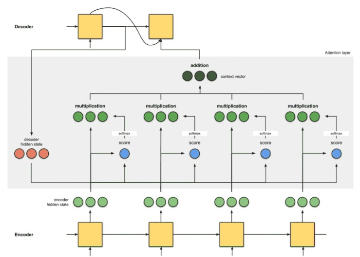
#### Intuition
1- A translator reads the German text while writing down the keywords from the start till the end.
2- he starts translating to English. While translating each German word, he makes use of the keywords he has written down.
  
### Attention: Examples

#### eq2seq with bidirectional encoder + attention - Bahdanau et. Al (2015)
- 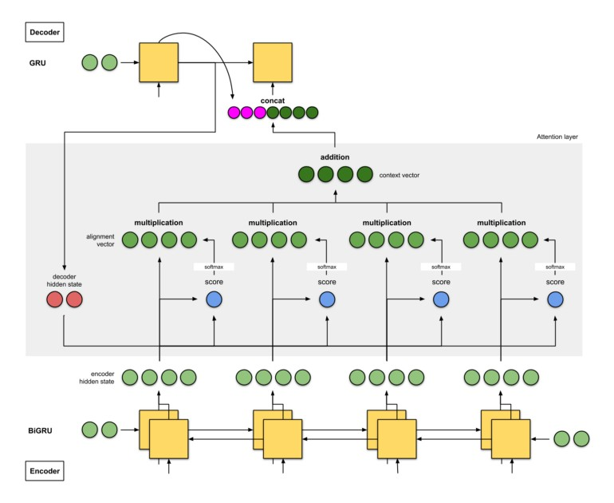
##### Intuition
1- Translator A reads the German text while writing down the keywords.
2- Translator B (who is more senior than Translator A) reads the same German text from the last word to the first.
3- two regularly discuss about every word they read thus far. Once done reading this German text, Translator B is then tasked to translate the German sentence to English word by word, based on the discussion and the consolidated keywords that the both of them have picked up.

#### seq2seq with 2-layer stacked encoder + attention - Luong et. Al (2015)
- 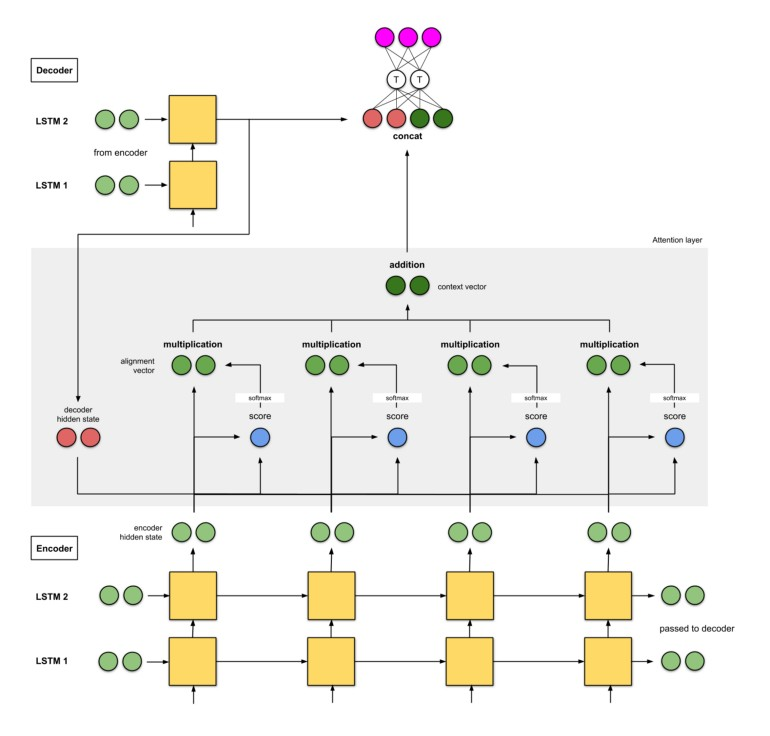
##### Intuition
1- Translator A reads the German text while writing down the keywords.
2- Translator B (who is more senior than Translator A) also reads the same German text.
3- Junior Translator A has to report to Translator B at every word they read.
4- Once done reading, the both of them translate the sentence to English together word by word, based on the consolidated keywords.

#### seq2seq with 8-stacked encoder (+bidirection+residual connections) + attention - Google’s Neural Machine Translation (GNMT)
- 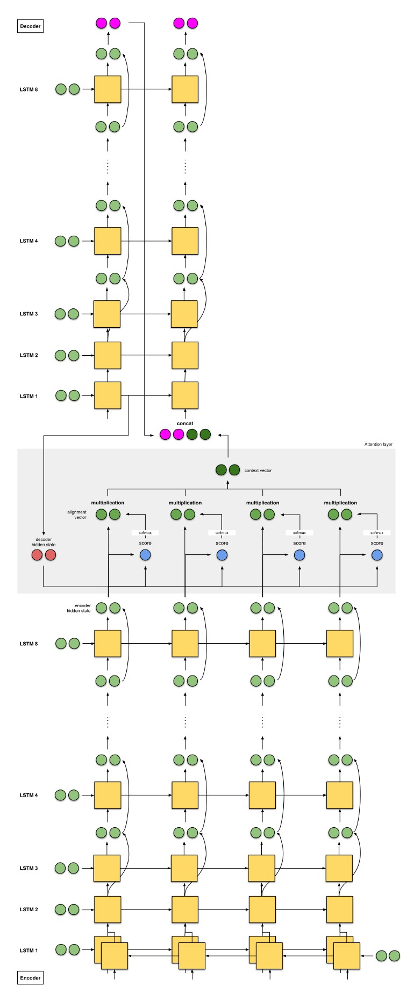
##### Intuition
1- 8 translators sit in a column from bottom to top.
2- Starting with Translator A, B, …, H. Every translator reads the same German text.
3- At every word, Translator A shares his findings with Translator B, who will improve it and share it with Translator C — repeat until Translator H.
4- Translator H writes down the relevant keywords based on what he knows and the information he has received.
5- Once everyone is done reading this English text, Translator A is told to translate the first word. First, he tries to recall, then he shares his answer with Translator B, who improves the answer and shares with Translator C — repeat until Translator H.
6- Translator H then writes the first translation word, based on the keywords he wrote and the answers he got. Repeat this until we get the translation out.

### Score Functions
- 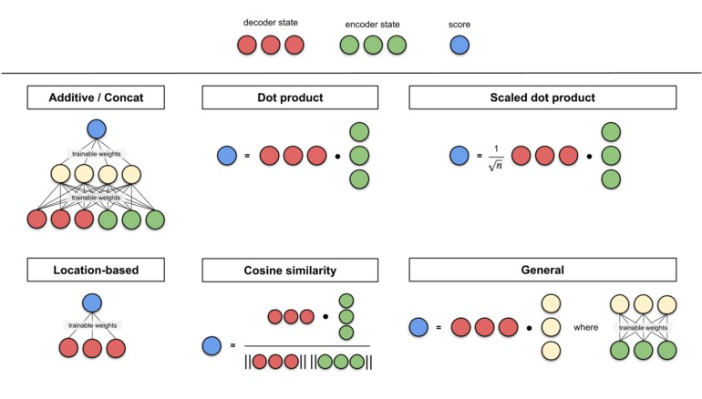

### Training an NMT with Attention

#### Teacher Forcing
- Provides faster training and higher accuracy by allowing the model to use the decoder’s actual output to compare its predictions against.

#### Training NMT
- input token: 0, target tokens: 1
- A copy of the input tokens are fed into the input **encoder** to be transformed into **key**, **value** vectors.
- A copy of the target tokens goes into **pre-attention decoder**.
  +  The **pre-attention decoder** Transform the prediction targets into a different vector space called query vector.
  +  Then takes the target tokens and make a **ShiftRight**.
- Convert the input and target to **Embbedings**.
- Now we have **query**, **key** and **value** vectors to use them as input to the **attention layer**.
- Also apply padding **mask** to help determine the padding tokens.
- The residual block adds the query to the result of the **attention layer**.
- The **attention layer** outputs its activations along with the **mask**.
- **Decoder**
  + The second select uses the **mask** to take (activations or 0) and the second copy of the target tokens, these are the true target which the **decoder** needs to compare.
  + Run everything through a **dense layer** with target vocab size.
  + Run the dense layer output through **LogSoftmax** which transforms the attention weights to distributions to compare it with the true target.
- 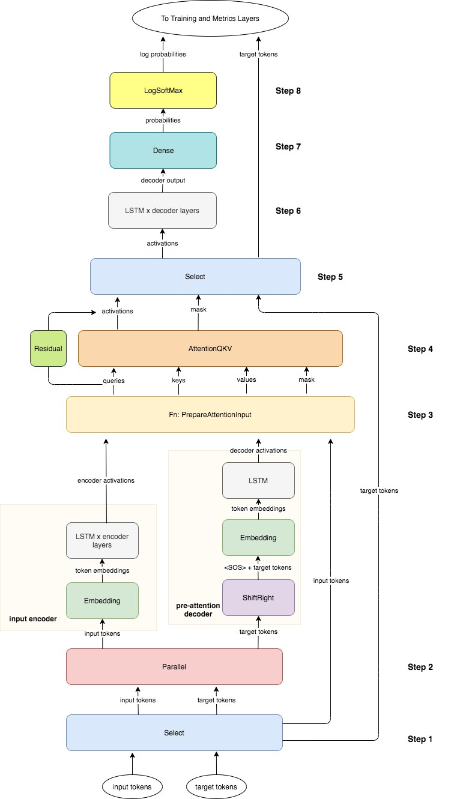

### Evaluation for Machine Translation

#### BLEU Score (Bilingual Evaluation Understudy) 
- Evaluates the quality of the machine-translated text by comparing “candidates” to one or more “reference” translations.
- 
- Note: BLEU doesn’t consider meaning or structure.

#### ROUGE Score (Recall-Oriented Understudy for Gisting Evaluation)
- Measures **precision** and **recall** between generated text and human-created text.

### Sampling and Decoding
- After all the necessary calculations have been performed on the encoder hidden states, and your model is ready to predict the next token, how will you choose to do it?

#### Greedy decoding
- Select the most probable word at every step.

#### Random sampling
- Provide probabilities for each word, and sample accordingly for the next outputs.

#### beam search
- Selects multiple options based on conditional probability.
- Parameter B is the limit of the number of branching paths (options).

#### Minimum Bayes Risk (MBR)
- Begin by generating several random samples.
- Then compare each sample against all its mates.
- Assign similarity score for each comparison.

## Week 2: Transformers

### Transformers vs RNNs
- Transformers differs from seq2seq by using multi-head attention layers instead of recurrent layers.

#### RNNs Disadvantages
- Parallel computing is difficult to implement.
- Loss of information if the sequence is long.
- Vanishing gradient problem.

#### Transformers
- Transformers are models specially designed to tackle some of the problems.

##### Transformers NLP Applications
- Text Summarization
- Auto-Complete
- Named entity recognition (NER)
- Question Answering (Q&A)
- ...

#### State of the Art Transformers
- **GPT-2: Generative Pre-traning for Transformer** - Radford, A Open AI (2018).
- **BERT (Bidirectional Encoder Representation from Transformers)** –  Devlin, J (2018) Goolge AI Language.
- **T5 (Text-to-Text Transfer Transformer)** –  Colin, R Goolgle (2019).
   + A powerful multi-task transformer.
   + 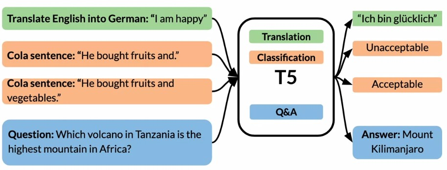
   
### Positional Encoding
- Used to retain the positional information of the input sequence by adding values to the embeddings.

### Self-attention
- An intention model that incorporates a dense layer for every input: **queries**, **keys**, and **values** which allows the inputs to interact with each other ("Self") and find out who they should pay more attention to ("attention").
- 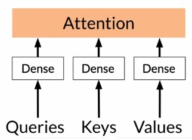

### Multi-headed attention
- Parallel self-attention layers ("heads") that concatenated to produce a single output.
- 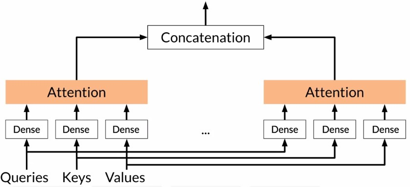

### Dot-Product Attention
- Input vectors are called **keys**
- Target vectors are called **queries**
- Each query is compared with all keys, and each key gets a probability.
- The **queries** by **keys** matrix is called **attention weights** which tells us how much each key is similar to each query.
- **Dot-product Attention** is essential for Transformers.
- The input to Attention are **queries**, **keys** and **values**.
#### Attention formula
- 
- Note: This is one of the **score functions**; the one that the paper used is **"Scaled Scaled Dot-Product Attention"** which the only difference is dividing by the square root of the dimension of the key vectors which leads to more stable gradients.

#### Multi-Head Attention formula
- 
- 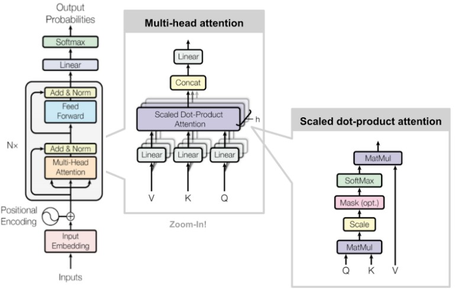

### Transformer Decoder
1. Input Embeddings: Trains a word to vector embedding.
2. Positional Encoding: Trains vectors to retain positional information.
3. N Decoder Blocks
   a. Multi-Head Attention Layer: Process each vector to help identify relationships.
   b. Norm Layer: Takes each Self-Attention through a residual connection and the Multi-Head Attention output and normalize it to speed up the training and reduce the overall processing time.
   c. Feed-Forward Layer: Embeddings are fed into a fully connected neural network with ReLU activation.
   d. Norm Layer
4. Linear Layer: simple fully connected neural network that projects the vector produced by the stack of decoders, into a much, much larger vector called a logits vector.
5. SoftMax Layer: Turns the logits vector into probabilities.

## Week 3: Transfer Learning

### Transfer Learning

#### Feature-based
- Taking high level features like (word embeddings) as features for your model.
- 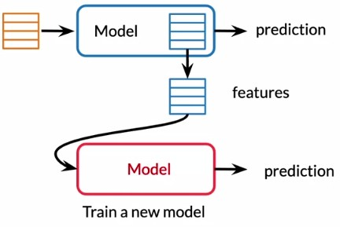

#### Fine-Tuning
- Using the pre-trained model weights and fine tune it for different tasks.
- 

### NLP History Summary
- 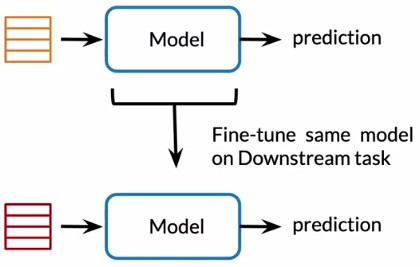

### BERT
- A multi layer bidirectional transformers that makes use of transfer learning/pre-training.

#### BERT_base architecture
- 12 layers (Transformers blocks)
- 12 attention heads
- 110 million parameters

#### BERT Input
- 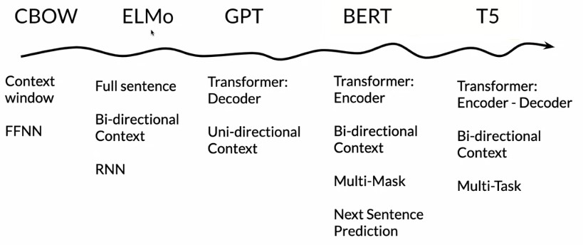

#### BERT Output visualization
- 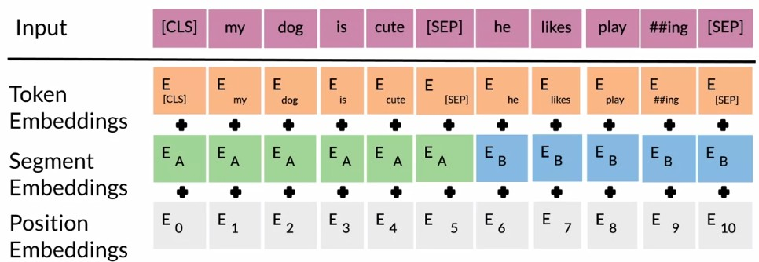

### T5 (Text-to-Text Transfer Transformers)
- T5 is an extremely large new neural network model that is trained on a mixture of unlabeled text from **C4 (Colossal Clean Crawled Corpus)** data set and labeled data from popular NLP tasks, then fine-tuned individually for each of the tasks.

- T5 represents the latest in a sequence of five or ten papers from the last couple of years on the same basic idea: **Training large neural networks on large amounts of unlabeled text, then fine- tuning them on labeled text for specific tasks**.

- The largest model (11 billion parameters) achieved state-of-the-art on many benchmarks such as **GLUE** and **SuperGLUE** benchmarks

#### C4 (Colossal Clean Crawled Corpus)
- A colossal, cleaned version of Common Crawl's web crawl corpus that is obtained by scraping web pages and ignoring the markup from the HTML.
- 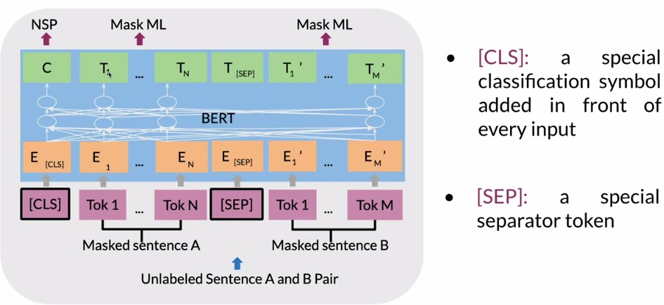

#### GLUE Benchmark
- A benchmark of nine different language comprehension tasks, a data set and a platform for evaluating and comparing the models.

#### Gradual unfreezing
- For the first epoch, freeze all layers except the last layer then only fine-tune the last layer, then unfreeze the last frozen layer then fine-tune it; and so on.

## Week 4: Complexity

### Transformer Complexity
- Attention on a sequence of length L, takes L squared time and memory.
- The more layers a model has, the more memory it needs.

### LSH (Locality Sensitive Hashing) Attention
- Locality Sensitive Hashing can reduce the computational costs of attention using LSH Attention.
   1- Hash Q and K
   2- Standard attention within same-hash bins.
   3- Repeat a few times to increase probability of key in the same bin.
- LSH Attention take advantage of parallel computing by chunking the LSH buckets.

### Memory Efficiency
- If you want to run a transformer over the entire text of a book, you might have around 1 million tokens to process, and each of these tokens will have an associated feature vector of some size, for example, 512.

- This means that just the input for the model is already 2GB in size. On a 16 gigabyte GPU, and you haven't even touched the layers yet, a transformer has two types of layers, attention layers an feedforward layers; A model might have 12 of each type of layer. In this case the activations would use around 50 GB of memory.

- 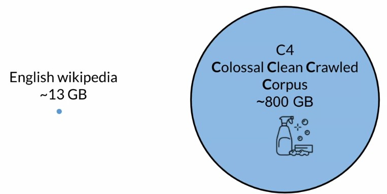

- And to do back-propagation through this model, the forward path will need to store some intermediate quantities in memory, this is the first fundamental efficiency challenge.

- Memory usage grows linearly with the number of layers, so there's no way to scale to the million token regime. Fortunately, the **Reversible Residual Layers** solved this problem.

### Reversible Residual Layers
- The key idea is that you start with two copies of the model inputs, then at each layer you only update one of them. The activations that you don't update will be the ones used to compute the residuals.

- 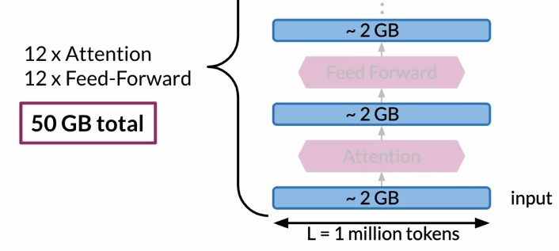

- The activations in the model are now twice as big, but you don't have to worry about caching for the backwards pass.

- First you find Y_1, then you use that to find Y_2. That's a forward pass for irreversible residual block. It's combined standard attention and feedforward residual layers from a regular transformer into a single reversible residual block, and there is nothing to be saved in memory except the Y_1 and Y_2 of the output layer instead of activations for every individual layer.

- 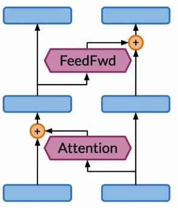

### Reformer
- Reformer is a transformer model designed to be memory efficient so it can handle very large context windows of upto 1 million words.
   + It uses LSH Attention to reduce the complexity of attending over long sequences.
   + it uses Reversible Residual Layers to more efficiently use the memory available.
