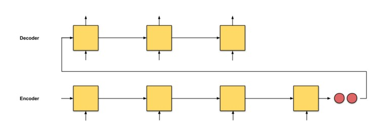
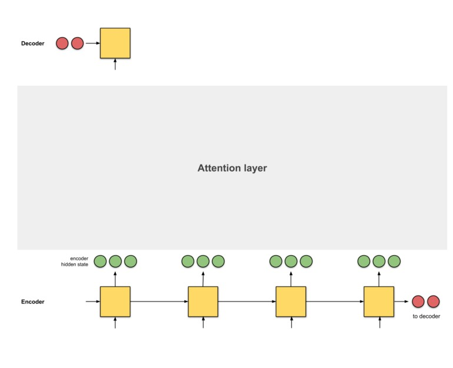
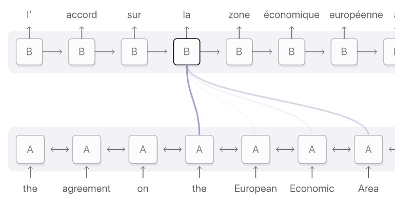

* [Course 4: Natural Language Processing with Attention Models](#Course-4-Natural-Language-Processing-with-Attention-Models)
   
  * [Week 1: Neural Machine Translation (NMT)](#Week-1-Neural-Machine-Translation-(NMT))
    * [Seq2seq (Google 2014)](#Seq2seq-(Google-2014))
      * [Intuition](#Intuition)
      * [Problems](#Problems)
      * [Solution](#Solution)
    * [Alignment](#Alignment)
    * [Attention](#Attention)
      * [Intuition](#Intuition)
    * [Attention: Examples](#Attention--Examples)
      * [seq2seq with bidirectional encoder + attention](#seq2seq-with-bidirectional-encoder-+-attention)
        * [Intuition](#Intuition)
      * [seq2seq with 2-layer stacked encoder + attention](#seq2seq-with-2-layer-stacked-encoder-+-attention)
        * [Intuition](#Intuition)
      * [seq2seq with 8-stacked encoder (+bidirection+residual connections) + attention](#seq2seq-with-8-stacked-encoder-(+bidirection+residual-connections)-+-attention)
        * [Intuition](#Intuition)
    * [Score Functions](#Score-Functions)
    * [Training an NMT with Attention](#Training-an-NMT-with-Attention)
      * [Teacher Forcing ](#Teacher-Forcing)
      * [Training NMT](#Training-NMT)
    * [Evaluation for Machine Translation](#Evaluation-for-Machine-Translation)
      * [BLEU Score](#BLEU-Score)
      * [ROUGE Score](#ROUGE-Score)
    
# Course 4: Natural Language Processing with Attention Models

## Week 1: Neural Machine Translation (NMT)

### Seq2seq (Google 2014)

#### Intuition
1- A translator reads the German text from start till the end.
2- Once done, he starts translating to English word by word.

#### Problems
- The last tokens of the sequences are given more importance.
- The only information that the **decoder** receives from the encoder is the **last encoder hidden state** (the 2 tiny red nodes) and This might lead to *catastrophic forgetting*
- When RNNs input is larger than the memory, an information bottleneck can occur.
- 

#### Solution
- Give the **decoder** a vector representation from every **encoder** time step so that it can make well-informed translations using the **attention layer**.
- With the **attention layer**, the model will be able to selectively focus on useful parts of the input sequence and hence, learn the alignment between them.
- 

### Alignment
- Matching segments of original text with their corresponding segments of the translation.
- 

### Attention
- Placing different focuses on different words by assigning each word with a score.
#### Implementation
- The implementations of an attention layer can be broken down into 4 steps.
  + Step 0: Prepare hidden states.
  + Step 1: Obtain a score for every encoder hidden state using a score function (alignment score).
    - his example, the score function is a dot product between the decoder and encoder hidden states.
  + Step 2: Run all the scores through a softmax layer.
  + Step 3: Multiply each encoder hidden state by its softmaxed score to obtain the alignment vector.
  + Step 4: Sum up the alignment vectors to produce the context vector.
  + Step 5: Feed the context vector into the decoder.
- 
#### Intuition
1- A translator reads the German text while writing down the keywords from the start till the end.
2- he starts translating to English. While translating each German word, he makes use of the keywords he has written down.
  
### Attention: Examples

#### eq2seq with bidirectional encoder + attention - Bahdanau et. Al (2015)
- 
##### Intuition
1- Translator A reads the German text while writing down the keywords.
2- Translator B (who is more senior than Translator A) reads the same German text from the last word to the first.
3- two regularly discuss about every word they read thus far. Once done reading this German text, Translator B is then tasked to translate the German sentence to English word by word, based on the discussion and the consolidated keywords that the both of them have picked up.

#### seq2seq with 2-layer stacked encoder + attention - Luong et. Al (2015)
- 
##### Intuition
1- Translator A reads the German text while writing down the keywords.
2- Translator B (who is more senior than Translator A) also reads the same German text.
3- Junior Translator A has to report to Translator B at every word they read.
4- Once done reading, the both of them translate the sentence to English together word by word, based on the consolidated keywords.

#### seq2seq with 8-stacked encoder (+bidirection+residual connections) + attention - Google’s Neural Machine Translation (GNMT)
- 
##### Intuition
1- 8 translators sit in a column from bottom to top.
2- Starting with Translator A, B, …, H. Every translator reads the same German text.
3- At every word, Translator A shares his findings with Translator B, who will improve it and share it with Translator C — repeat until Translator H.
4- Translator H writes down the relevant keywords based on what he knows and the information he has received.
5- Once everyone is done reading this English text, Translator A is told to translate the first word. First, he tries to recall, then he shares his answer with Translator B, who improves the answer and shares with Translator C — repeat until Translator H.
6- Translator H then writes the first translation word, based on the keywords he wrote and the answers he got. Repeat this until we get the translation out.

### Score Functions
- 

### Training an NMT with Attention

#### Teacher Forcing
- Provides faster training and higher accuracy by allowing the model to use the decoder’s actual output to compare its predictions against.

#### Training NMT
- input token: 0, target tokens: 1
- A copy of the input tokens are fed into the input **encoder** to be transformed into **key**, **value** vectors.
- A copy of the target tokens goes into **pre-attention decoder**.
  +  The **pre-attention decoder** Transform the prediction targets into a different vector space called query vector.
  +  Then takes the target tokens and make a **ShiftRight**.
- Convert the input and target to **Embbedings**.
- Now we have **query**, **key** and **value** vectors to use them as input to the **attention layer**.
- Also apply padding **mask** to help determine the padding tokens.
- The residual block adds the query to the result of the **attention layer**.
- The **attention layer** outputs its activations along with the **mask**.
- **Decoder**
  + The second select uses the **mask** to take (activations or 0) and the second copy of the target tokens, these are the true target which the **decoder** needs to compare.
  + Run everything through a **dense layer** with target vocab size.
  + Run the dense layer output through **LogSoftmax** which transforms the attention weights to distributions to compare it with the true target.
- 

### Evaluation for Machine Translation

#### BLEU Score (Bilingual Evaluation Understudy) 
- Evaluates the quality of the machine-translated text by comparing “candidates” to one or more “reference” translations.
- 
- Note: BLEU doesn’t consider meaning or structure.

#### ROUGE Score (Recall-Oriented Understudy for Gisting Evaluation)
- Measures **precision** and **recall** between generated text and human-created text.
