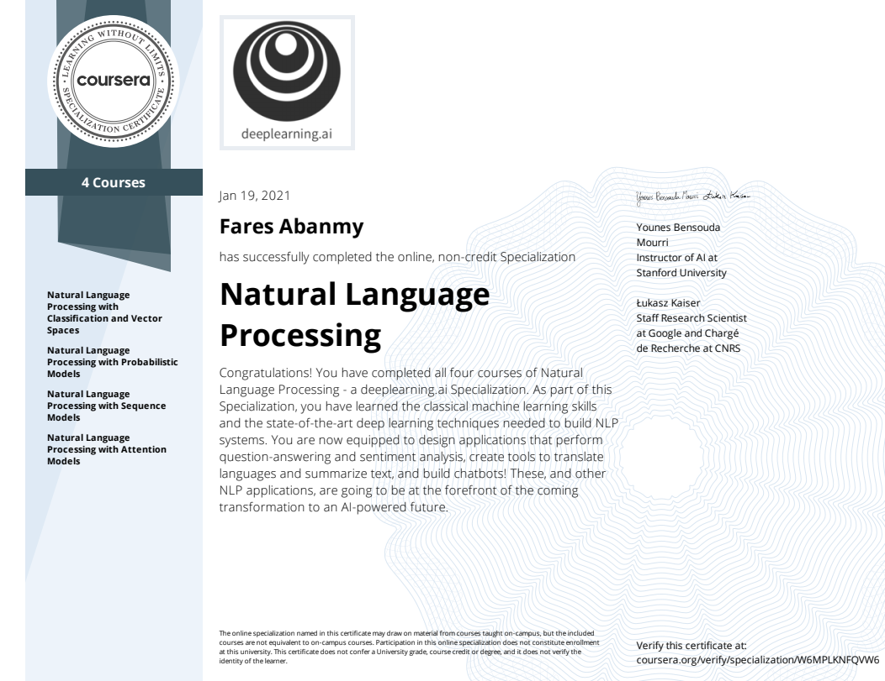

# NLP-Specialization
This repository contains my personal notes and summaries on NLP specialization courses. I've enjoyed every little bit of the course hope you enjoy the summary too.

[DeepLearning.ai](https://deeplearning.ai) provides four courses which can be taken on [Coursera](https://www.coursera.org/specializations/natural-language-processing). The four courses titles are:

1. [Natural Language Processing with Classification and Vector Spaces](https://github.com/PharesAbanmy/NLP-Specialization-Summary/tree/master/1.%20Natural%20Language%20Processing%20with%20Classification%20and%20Vector%20Spaces)
2. [Natural Language Processing with Probabilistic Models](https://github.com/PharesAbanmy/NLP-Specialization-Summary/tree/master/2.%20Natural%20Language%20Processing%20with%20Probabilistic%20Models)
3. [Natural Language Processing with Sequence Models](https://github.com/PharesAbanmy/NLP-Specialization-Summary/tree/master/3.%20Natural%20Language%20Processing%20with%20Sequence%20Models)
4. [Natural Language Processing with Attention Models](https://github.com/PharesAbanmy/NLP-Specialization-Summary/tree/master/4.%20Natural%20Language%20Processing%20with%20Attention%20Models)

This is by far the best course series on NLP that I've taken. Enjoy!

## About This Specialization (From the official Deep Learning Specialization page)

> Natural Language Processing (NLP) uses algorithms to understand and manipulate human language. This technology is one of the most broadly applied areas of machine learning. As AI continues to expand, so will the demand for professionals skilled at building models that analyze speech and language, uncover contextual patterns, and produce insights from text and audio.

